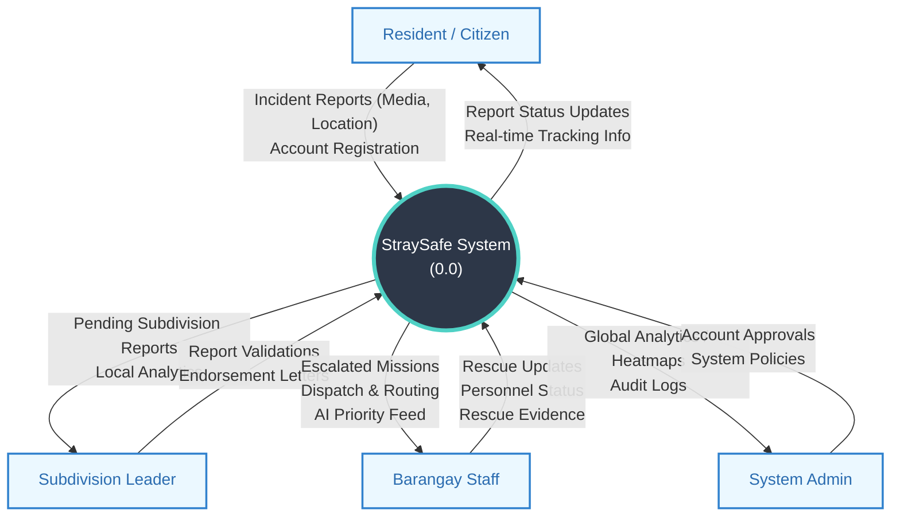

# Level 0 Data Flow Diagram (Context Diagram)

The **Level 0 Data Flow Diagram (DFD)**, also known as a Context Diagram, provides a high-level view of the entire StraySafe system. It represents the system as a single main process and shows how it interacts with external entities (the users) through data flows.

## 📊 Context Diagram

---

## 📝 Proposed System Level 0 DFD Explanation – STRAY-SAFE

### 1. The Core System (The Center)
**StraySafe System (labeled "0.0")**

The circle in the center represents the proposed automated stray animal reporting and rescue management platform. All reports, validations, AI-assisted prioritizations, dispatching, and monitoring activities pass through this central system.

### 2. External Entities (The Outside Blocks)

These are the people or groups interacting with the proposed system:

**Resident / Citizen**

The end user who submits stray animal incident reports, provides media (photos/videos) and exact GPS locations, and tracks the status of their reports in real-time.

**Subdivision Leader**

The community representative who acts as the validation layer. They review resident reports within their jurisdiction, filter out invalid data, and generate endorsement letters before escalating legitimate concerns to the barangay.

**Barangay Staff**

The operational personnel who receive AI-prioritized, validated reports. They manage the dispatching of rescue teams, handle field operations using immersive navigation, and provide real-time updates and evidence.

**System Admin**

The governing personnel who manage system-wide settings, approve official accounts, and utilize global analytics and heatmaps for long-term strategic decision-making.

### 3. Data Flows (The Arrows)

The labeled arrows show the information exchanged between the external entities and the proposed system process:

**Resident / Citizen → System (Incident Reports & Account Data)**

The citizen submits stray animal reports including animal details, media, and location pins, along with their account registration data.

**System → Resident / Citizen (Status Updates & Notifications)**

The proposed system provides the citizen with real-time tracking information on their reports (e.g., Pending, Dispatched, Resolved) and push notifications.

**Subdivision Leader → System (Validations & Endorsement Letters)**

The subdivision leader submits their verification decisions (approve/reject) and attaches official endorsement letters for escalated reports.

**System → Subdivision Leader (Pending Reports & Local Analytics)**

The system delivers a filtered queue of new incident reports originating specifically from the leader's subdivision, along with localized analytics.

**Barangay Staff → System (Rescue Updates, Evidence, & Status)**

The barangay staff inputs real-time updates during a rescue mission, uploads visual evidence of the operation, and manages personnel availability statuses.

**System → Barangay Staff (Escalated Missions, AI Feed, & Routing)**

The system forwards fully validated and AI-prioritized rescue missions to the staff, providing them with optimized dispatch routing and active operation feeds.

**System Admin → System (Account Approvals & System Policies)**

The system administrator inputs configurations for boundaries, AI thresholds, category definitions, and grants access to official personnel accounts.

**System → System Admin (Global Analytics & Audit Logs)**

The system provides administrators with overarching heatmaps, long-term historical data, and detailed audit logs of all system activities.
