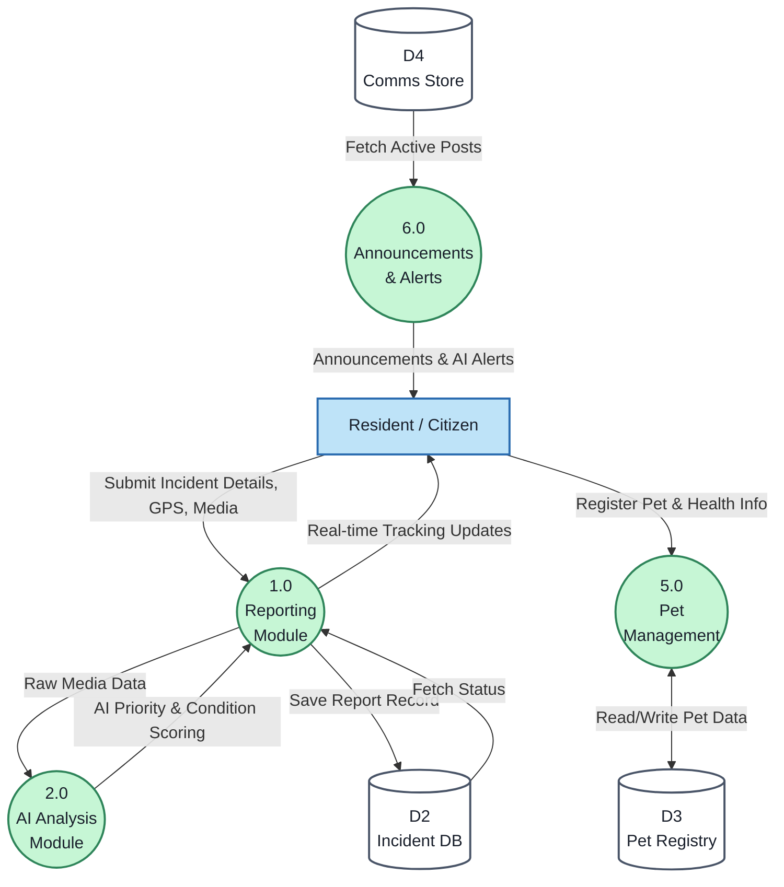
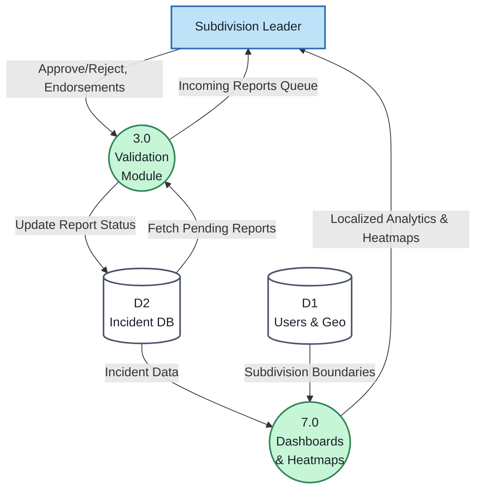
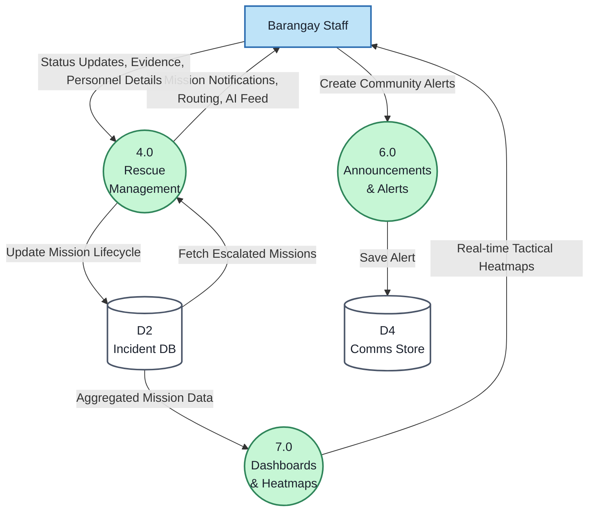
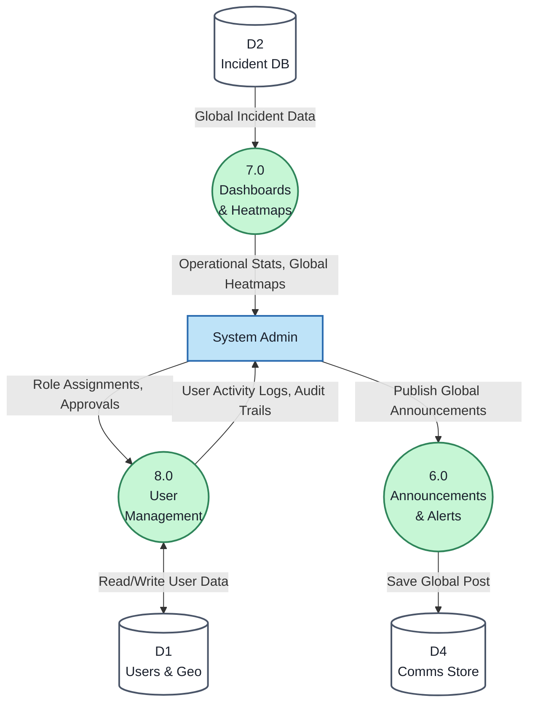

# Level 1 Data Flow Diagram (DFD) - Core Modules

This document expands the Level 0 Context Diagram by breaking down the "StraySafe System" into its core processes (modules), based on the **System Flow Documentation** and mapping them to the specific Data Stores derived from the **Database Schema**.

---

## 🗄️ System Entities, Processes & Data Stores

### External Entities
1. **Resident / Citizen**
2. **Subdivision Leader**
3. **Barangay Staff**
4. **System Admin**

### Processes (From System Flow Documentation)
*   **1.0 Reporting & Media Collection:** Handles report submission with GPS and images.
*   **2.0 AI Analysis:** Evaluates animal classification and condition for priority scoring.
*   **3.0 Validation Workflow:** Manages duplicate detection and subdivision leader escalation.
*   **4.0 Rescue Management:** Command center operations, dispatching, and case lifecycle.
*   **5.0 Pet Management:** Registry of owned pets, health history, and lost/found status.
*   **6.0 Announcements & Notifications:** Status updates, hazard alerts, and community posts.
*   **7.0 Monitoring & Dashboards:** Analytics, interactive maps, and heatmaps.
*   **8.0 User & Access Management:** RBAC, account administration.

### Data Stores (From Database.txt)
*   **D1: Users & Geo Store:** `users`, `roles`, `positions`, `barangays`, `subdivisions`
*   **D2: Incident Database:** `reports`, `report_categories`, `report_status`, `letter_status`
*   **D3: Pet Registry:** `pets`, `pet_vaccinations`, `pet_incidents`
*   **D4: Communications Store:** `announcements`, `announcement_media`, `announcement_comments`, `announcement_reactions`, `announcement_views`

---

## 📊 Level 1 DFD Diagrams (Per Module)

Below are the expanded Level 1 Data Flow Diagrams broken down by user module to provide a clearer, focused view of how each entity interacts with the system.

### Figure 1.0 | Level 1 Data Flow Diagram: Resident Module

### Figure 2.0 | Level 1 Data Flow Diagram: Subdivision Leader Module

### Figure 3.0 | Level 1 Data Flow Diagram: Barangay Staff Module

### Figure 4.0 | Level 1 Data Flow Diagram: System Admin Module

---

## 📝 Proposed System Level 1 DFD Explanation – Per User

This section details exactly how each external entity interacts with the specific System Modules (Processes) and Data Stores in the proposed STRAY-SAFE system.

### 1. Resident / Citizen Data Flows

**Resident / Citizen → 1.0 Reporting Module**
Submits incident details, category classifications, GPS locations, uploaded media files, and animal descriptions.

**Resident / Citizen → 5.0 Pet Management Module**
Registers pet ownership, vaccination history, and files lost/found pet reports.

**6.0 Announcements & Alerts → Resident / Citizen**
Receives announcement updates, AI-assisted matching alerts, rescue progress notifications, and real-time report tracking updates.

---

### 2. Subdivision Leader Data Flows

**Subdivision Leader → 3.0 Validation Module**
Submits report approval or rejection decisions, verification remarks, endorsement letters, and escalation requests for their specific community.

**3.0 Validation Module → Subdivision Leader**
Receives incoming reports pending validation and structured verification queues.

**7.0 Dashboards & Heatmaps → Subdivision Leader**
Receives localized incident analytics, heatmaps and monitoring tools, and escalation tracking information tailored to their subdivision boundary.

---

### 3. Barangay Staff Data Flows

**Barangay Staff → 4.0 Rescue Management Module**
Submits mission completion reports, rescue operation updates, personnel assignment statuses, uploaded rescue evidence, and impoundment details.

**Barangay Staff → 6.0 Announcements & Alerts**
Creates community alerts and safety announcements based on active operations.

**4.0 Rescue Management Module → Barangay Staff**
Receives mission notifications, optimized routing information, verified rescue missions, AI-prioritized incidents, and dispatch instructions.

**7.0 Dashboards & Heatmaps → Barangay Staff**
Views real-time tactical heatmaps and global operational monitoring tools.

---

### 4. System Admin Data Flows

**System Admin → 8.0 User Management Module**
Submits role assignments, user account approvals, and configures system-wide access policies.

**System Admin → 6.0 Announcements & Alerts**
Publishes system-wide global announcements.

**8.0 User Management Module → System Admin**
Receives user activity logs and account status audit trails.

**7.0 Dashboards & Heatmaps → System Admin**
Receives comprehensive operational statistics, historical records, rescue analytics, and overall stray density heatmaps.
