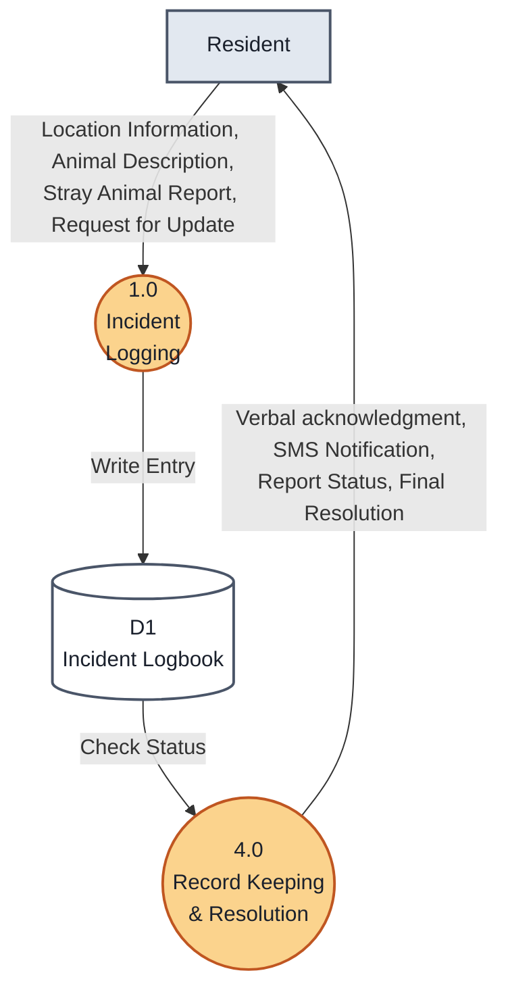
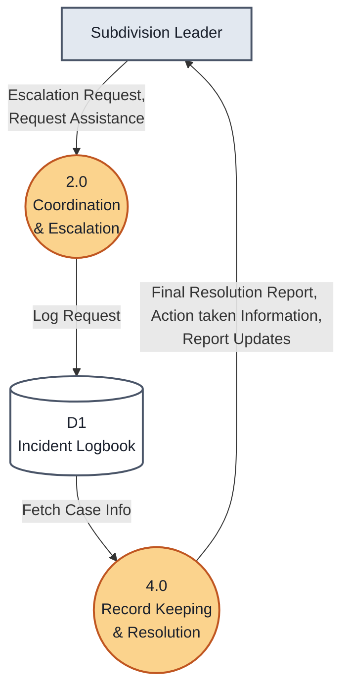
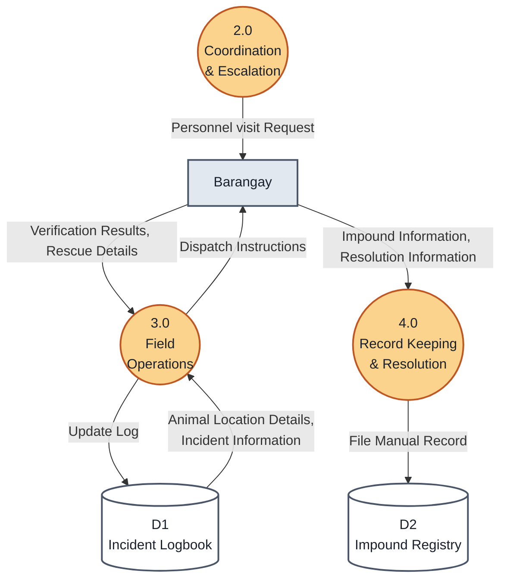

# Level 1 Data Flow Diagram (DFD) - Existing (Manual) System

This document breaks down the "Manual Stray Management" Level 0 Context Diagram into a Level 1 DFD. It identifies the manual processes and physical data stores used before the implementation of STRAY-SAFE.

---

## 🗄️ Manual System Entities, Processes & Data Stores

### External Entities
1. **Resident**
2. **Subdivision Leader**
3. **Barangay**

### Manual Processes
*   **1.0 Incident Logging:** The manual process of receiving complaints and recording them in a physical logbook.
*   **2.0 Coordination & Escalation:** The manual communication/dispatch workflow between subdivision leaders and the barangay office.
*   **3.0 Field Operations:** The physical deployment of barangay personnel for verification and rescue.
*   **4.0 Record Keeping & Resolution:** Filing impound records and manually updating residents/leaders on case status.

### Manual Data Stores
*   **D1: Physical Incident Logbook:** Paper records of all reported incidents.
*   **D2: Impound Registry:** Paper records of captured animals and resolution details.

---

## 📊 Level 1 DFD Diagrams (Per User)

Below are the expanded Level 1 Data Flow Diagrams broken down by entity for the **Existing System**.

### Figure 1.0 | Level 1 Data Flow Diagram: Resident (Existing)

### Figure 2.0 | Level 1 Data Flow Diagram: Subdivision Leader (Existing)

### Figure 3.0 | Level 1 Data Flow Diagram: Barangay (Existing)

---

## 📝 Existing System Level 1 DFD Explanation – Per User

This section details how each entity interacted with the manual processes and physical records in the existing system, using the exact terminology from the Manual Stray Management diagram.

### 1. Resident Data Flows (Existing)

**Resident → 1.0 Incident Logging**
The resident manually submits or calls in their **Stray Animal Report**, providing the **Animal Description** and **Location Information**, or makes a **Request for Update** on a previous report.

**4.0 Record Keeping & Resolution → Resident**
The barangay staff manually contacts the resident to provide a **Verbal acknowledgment**, an **SMS Notification**, the current **Report Status**, or the **Final Resolution** of the case.

---

### 2. Subdivision Leader Data Flows (Existing)

**Subdivision Leader → 2.0 Coordination & Escalation**
The subdivision leader manually contacts the barangay to submit an **Escalation Request** or **Request Assistance** for a community issue.

**4.0 Record Keeping & Resolution → Subdivision Leader**
The barangay manually provides the leader with **Report Updates**, **Action taken Information**, and the **Final Resolution Report** for cases in their area.

---

### 3. Barangay Data Flows (Existing)

**2.0 / 3.0 Processes → Barangay**
Barangay personnel receive the **Personnel visit Request**, along with **Animal Location Details** and **Incident Information** retrieved from the physical logbook to initiate a field response.

**Barangay → 3.0 / 4.0 Processes**
After a manual operation, the personnel report back their **Verification Results** and **Rescue Details**, and manually file the **Impound Information** and **Resolution Information** into the physical registries.
