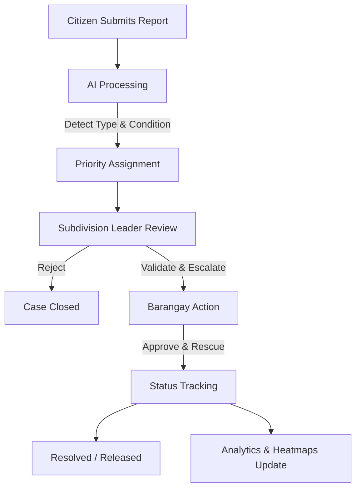

# STRAY-SAFE SYSTEM DOCUMENTATION

STRAY-SAFE is a role-based, AI-assisted reporting and rescue system designed to streamline the management of stray animals through community involvement and intelligent automation.

---

## 👥 User Roles & Responsibilities

### 🏙️ Citizen (Reporter)
The primary source of information. Citizens report stray animal sightings in their community.
- **Submit Reports:** Provide image, location (GPS), and description.
- **Track Status:** View real-time updates on reported cases.
- **Notifications:** Receive alerts regarding the progress of their reports.

### 🏘️ Subdivision Leader (Validator Layer)
Acts as a middle validation layer to reduce noise and ensure high-quality data before it reaches local authorities.
- **Review Reports:** Filter out fake or duplicate reports.
- **Validate Legitimacy:** Confirm the accuracy of the incident.
- **Escalate:** Forward valid reports to the Barangay for formal action.
- **Monitor Area:** Oversee all cases within their assigned subdivision.

### 🏢 Barangay Staff (Action Layer)
The response team responsible for field operations and animal welfare.
- **Rescue Operations:** Approve or reject rescue requests based on urgency and resources.
- **Field Action:** Perform the physical pickup of the animal.
- **Lifecycle Management:** Update the case status through the following stages:
  - `Pending` ➔ `Approved` ➔ `Picked Up` ➔ `Under Observation (3 Days)` ➔ `Impounded` ➔ `Resolved / Released`

### 🛡️ Admin (System Controller)
Oversees the entire ecosystem to ensure performance and data integrity.
- **RBAC Management:** Manage user accounts and permissions.
- **System Oversight:** Monitor all reports and system performance.
- **Analytics:** View heatmaps and density data to identify high-risk areas.
- **Configuration:** Manage system-wide settings and Barangay coordination.

---

## 🤖 AI Capabilities

The system leverages **TensorFlow.js** for real-time image analysis and decision support.

1.  **Animal Type Identification**
    - Detects whether the animal in the image is a **Dog** or a **Cat**.
2.  **Condition Detection**
    - Analyzes visible features to classify the animal's state: **Injured**, **Weak/Sick**, or **Normal**.
3.  **Automatic Case Prioritization**
    - **High Priority:** Injured animals requiring immediate attention.
    - **Regular Priority:** Healthy/Normal stray sightings.
4.  **Decision Support for Authorities**
    - Helps leaders and staff prioritize their response based on data-driven insights.

---

## 🔄 System Workflow

1.  **Submission:** Citizen uploads image + GPS + description.
2.  **Processing:** AI automatically classifies the animal and condition.
3.  **Review:** Subdivision Leader filters noise and validates the request.
4.  **Action:** Barangay conducts the rescue and updates status.
5.  **Analytics:** Data contributes to real-time heatmaps and performance dashboards.

---

## 🧩 Core System Modules

| Module | Description |
| :--- | :--- |
| **Reporting** | Image/GPS submission and real-time category tagging. |
| **Validation** | Subdivision review system with duplicate/fake report filtering. |
| **Rescue Management** | Barangay approval workflow and status lifecycle tracking. |
| **AI-Assisted** | Image classification, condition detection, and priority scoring. |
| **Monitoring & Dashboard** | Map visualization, heatmaps, and analytical charts. |
| **Notification** | Real-time status updates and priority alerts. |
| **User Management** | Role-Based Access Control (RBAC) and account security. |
| **History & Records** | Comprehensive incident logs and animal report history. |

---

## 🛠️ Tech Stack

- **Frontend:** React (Vite)
- **Backend:** FastAPI (Python)
- **Database:** MySQL
- **AI Engine:** TensorFlow.js
- **Services:** Google Maps API, Geolocation API

---

## 🎨 UI Color Palette

| Color | Hex | Purpose |
| :--- | :--- | :--- |
| 🟠 **Burnt Orange** | `#F97316` | Rescues, Urgency, Warmth |
| 🟡 **Soft Amber** | `#FACC15` | Hope, Positivity |
| 🟢 **Sage Green** | `#86EFAC` | Care, Healing |
| ⚪ **Off White** | `#FAFAF9` | Clean Background |
| 🔴 **Soft Red** | `#EF4444` | Urgent / Injured Alerts |

---
*Document Version: 1.0.0*
